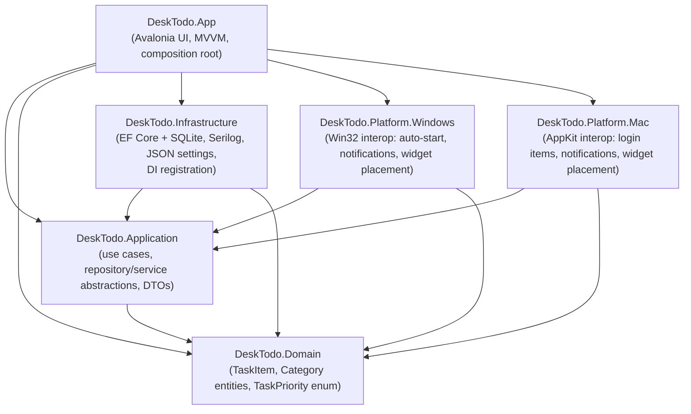

# DeskTodo — Architecture

## Layering

DeskTodo follows Clean Architecture. Dependencies point inward only —
outer layers reference inner layers, never the reverse. The Domain layer has
no dependencies on any other project or third-party framework.



`DeskTodo.Tests` references every layer, including `DeskTodo.App`, so
ViewModels can be unit tested directly.

## Why this shape

- **Domain** holds `TaskItem` and `Category` entities and the `TaskPriority`
  enum. It has zero package references — it compiles against nothing but
  the BCL — so it can be reused for a future Linux target, a CLI tool, or a
  test harness without dragging in Avalonia or EF Core.
- **Application** defines the *abstractions* the rest of the app depends on
  (`ITaskRepository`, `ICategoryRepository`) plus orchestration use cases
  (`ITaskService`/`TaskService`) — following the Repository pattern and
  Dependency Inversion Principle. Nothing in this layer knows about EF
  Core, Avalonia, or Win32/AppKit.
- **Infrastructure** implements the platform-agnostic abstractions: an EF
  Core `DbContext` backed by SQLite (repositories, migrations), Serilog
  configuration, and JSON-backed settings persistence.
- **Platform.Windows** / **Platform.Mac** implement the *platform-specific*
  abstractions from Application — auto-start/login-item registration,
  native notification integration, and desktop-level widget window
  placement. Both projects target plain `net10.0` (not `net10.0-windows`)
  so the cross-platform `App` project can reference both unconditionally;
  all OS-specific interop is guarded with `OperatingSystem.IsWindows()` /
  `OperatingSystem.IsMacOS()`. The DI composition root picks the correct
  implementation at startup based on the running OS — the UI layer never
  branches on platform itself. Adding Linux support later is a matter of
  adding `DeskTodo.Platform.Linux` and one more DI branch.
- **App** is the Avalonia MVVM presentation layer and composition root: it
  wires up Microsoft.Extensions.DependencyInjection and contains
  Views/ViewModels for every page (splash, widget, calendar, settings,
  about, update checker).

## Solution-level tooling decisions

- **Central Package Management** (`Directory.Packages.props`) pins every
  NuGet package version in one place so all seven projects stay in
  lock-step — no per-project version drift. It's also where a transitive
  dependency's version gets overridden when needed (see below).
- **`Directory.Build.props`** centralizes `Nullable`, `ImplicitUsings`,
  `LangVersion`, assembly metadata, and `GenerateDocumentationFile` for all
  non-test projects.
- **Classic `.sln` format** (not the newer `.slnx`) was chosen deliberately
  for broadest compatibility with Visual Studio, Rider, and MSIX/DMG
  packaging tooling on both target OSes.
- **`global.json`** pins the SDK to `10.0.200` with `rollForward:
  latestFeature` so CI and every contributor build with the same major/minor
  toolchain.
- **`SQLitePCLRaw.lib.e_sqlite3` is pinned to `3.53.3`** in
  `Directory.Packages.props`. `Microsoft.EntityFrameworkCore.Sqlite`
  10.0.10 pulls in version `2.1.11` of that package by default, which
  bundles a build of SQLite affected by
  [GHSA-2m69-gcr7-jv3q](https://github.com/advisories/GHSA-2m69-gcr7-jv3q)
  (fixed in SQLite 3.50.2+). Unlike its sibling `.core`/`.provider`/`.bundle`
  packages, `.lib.e_sqlite3`'s version number directly tracks the bundled
  SQLite version, so pinning just this one package (via CPM's transitive
  pinning) is enough to pull in a patched native SQLite build — confirmed
  via `dotnet restore` reporting zero `NU1903` warnings after the pin.

## A namespace collision worth knowing about

`DeskTodo.App`'s own namespace is a sibling of `DeskTodo.Application`
under the shared `DeskTodo` root. C#'s simple-name lookup resolves a
sibling namespace member (`DeskTodo.Application`, visible as `Application`
from inside `DeskTodo.App`) *before* it ever considers a `using` directive
for `Avalonia.Application` — including a `global using` alias, which is
resolved even later. The fix used throughout the App project is to fully
qualify the Avalonia type (`global::Avalonia.Application`) at the few
points that need it (see `App.axaml.cs`), rather than renaming either
project. This collision reproduces under any name pair shaped like
`X.App` / `X.Application`.

## UI pages (scaffolded, not yet implemented)

`DeskTodo.App/Views` and `ViewModels` reserve a folder per planned page:
`Splash`, `Widget` (the always-visible task widget itself — currently
`WidgetWindow`/`WidgetViewModel` at the Views/ViewModels root), `Calendar`
(day navigation / date picker), `Settings`, `About`, `UpdateChecker`.

## Core infrastructure and dependency injection

`DeskTodo.App/Program.cs` builds a `Microsoft.Extensions.Hosting` generic
host and hands off to Avalonia's classic desktop lifetime:

1. A Serilog **bootstrap logger** (console-only) is created first, so
   failures during host construction itself are still logged.
2. `Host.CreateDefaultBuilder(args)` is composed with:
   - `.UseDeskTodoLogging()` (`Infrastructure/Logging/SerilogHostingExtensions.cs`)
     — reads sinks/levels declaratively from the `"Serilog"` section of
     `appsettings.json` and adds a rolling daily file sink whose path comes
     from `AppStorageOptions` at runtime.
   - `AddInfrastructure(configuration)` (`Infrastructure/DependencyInjection/ServiceCollectionExtensions.cs`)
     — binds `AppStorageOptions` from the `"AppStorage"` config section and,
     when `RootDirectory` is left blank, defaults it via
     `AppStoragePaths.ResolveDefaultRootDirectory()` (`%LOCALAPPDATA%\DeskTodo`
     on Windows, `~/Library/Application Support/DeskTodo` on macOS).
   - `AddDeskTodoApp()` (`App/DependencyInjection/ServiceCollectionExtensions.cs`)
     — registers ViewModels; will grow as pages are added.
3. `host.Start()` (not `.Run()`) starts hosted services in the background
   without blocking, since Avalonia's `StartWithClassicDesktopLifetime`
   owns the actual blocking message loop.
4. `App.Services` (a static property, set only at this point) lets
   `App.OnFrameworkInitializationCompleted` resolve `WidgetViewModel` from
   the container — with a `new WidgetViewModel()` fallback so the XAML
   previewer still works at design-time.

Verified end-to-end: the built app creates
`~/Library/Application Support/DeskTodo/logs/desktodo-*.log` on macOS
(and the equivalent `%LOCALAPPDATA%\DeskTodo\logs\` on Windows), with both
console and file sinks receiving structured log entries.

Options binding is covered by
`tests/DeskTodo.Tests/Infrastructure/ServiceCollectionExtensionsTests.cs`,
which asserts both the OS-default path resolution and that an explicit
`AppStorage:RootDirectory` override is honored.

## Domain model and persistence

**No separate "day" entity.** `TaskItem.PlanDate` (a `DateOnly`) is which
day's list a task belongs to; there is no `DailyPlan`/day table. A day with
zero tasks is just zero rows with that `PlanDate` — "auto-create a new day"
needs no code at all, and there's no risk of a day-record and its tasks
drifting out of sync. `TaskItem.DayOrder` doubles as the displayed "task
number" (position + 1) and as the field drag-to-reorder writes to.

**No single "TaskStatus" enum.** Completed, Pinned, Archived and Deleted
are independent booleans (a task can be pinned *and* completed, archived
*and* pinned, etc.) — modeling them as one enum would force artificial
mutual exclusivity. Overdue is a computed property (`DueDate` in the past
and not completed), not stored state, since "is it overdue" changes with
the current time rather than through any user action.

**Named `TaskItem`, not `Task`**, to avoid colliding with
`System.Threading.Tasks.Task` — every repository/service method already
returns `Task<TaskItem>`, and `Task<Task>` would be exactly the kind of
same-name confusion the `DeskTodo.App`/`DeskTodo.Application` namespace
collision (above) is a cautionary tale about.

**A lightly rich domain model**: `TaskItem.Complete()`, `.Reopen()`,
`.Pin()`, `.Archive()`, `.SoftDelete()`, `.Restore()` encapsulate the
"toggle a flag and stamp `ModifiedAt`" logic in one place rather than
scattering it across `TaskService` and, later, ViewModels. `Delete` is a
soft delete (`IsDeleted`) so it stays recoverable — matching the "Undo" and
"recover unsaved edits" requirements — rather than removing the row.

**`ITaskRepository`/`ICategoryRepository` are per-aggregate, not a generic
`IRepository<T>`.** A generic repository over EF Core is widely considered
redundant (`DbSet<T>` already *is* a generic repository) and tends to leak
either too little (forcing `IQueryable<T>` back out through the
abstraction, defeating the point of the abstraction) or too much. Each
method here is a **self-contained unit of work** — it persists immediately
rather than exposing a separate `SaveChangesAsync` — because Infrastructure
creates a new, short-lived `DeskTodoDbContext` per call via
`IDbContextFactory<DeskTodoDbContext>` rather than sharing one context for
the app's lifetime. That's the EF Core–recommended pattern for WPF/Avalonia-style
long-running desktop processes: a single shared `DbContext` both isn't
thread-safe and would let its change tracker grow unbounded for the life of
the process. One consequence worth knowing: `TaskRepository.UpdateAsync`
sets `context.Entry(task).State = EntityState.Modified` rather than calling
`DbSet.Update(task)`, because `Update()` walks the *entire reachable object
graph* — a task fetched via `GetByDateAsync` (which `.Include()`s
`Category`) would otherwise also attach and mark the related `Category` row
as modified.

**Categories are entities, not an enum**, since each needs its own
user-visible color and users can create custom ones (`Category.IsBuiltIn`
distinguishes the seven seeded defaults — Personal, Office, Learning,
Fitness, Shopping, Finance, Family — from user-created categories; only the
latter can be deleted). The seven defaults are seeded via EF Core's
`HasData` in `CategoryConfiguration`, keyed by fixed `Guid`s (not
`Guid.NewGuid()`, which would create a new "seed" on every model build and
churn the migration).

**Migrations** are checked in under `Infrastructure/Data/Migrations/` and
applied automatically on startup (`DatabaseInitializer.MigrateDeskTodoDatabaseAsync`,
called from `Program.cs` right after `host.Start()`) — this is what "support
automatic migrations" means in practice: no manual `dotnet ef database
update` step for end users. The EF Core CLI itself is pinned as a
**local** tool (`.config/dotnet-tools.json`, restored via `dotnet tool
restore`) rather than assumed to be globally installed, so any contributor
gets the exact same tool version. Generating a new migration:

```bash
dotnet tool restore
dotnet ef migrations add <Name> \
  --project src/DeskTodo.Infrastructure/DeskTodo.Infrastructure.csproj \
  --startup-project src/DeskTodo.App/DeskTodo.App.csproj \
  --output-dir Data/Migrations
```

Note `DeskTodo.App.csproj` carries its own `Microsoft.EntityFrameworkCore.Design`
reference (in addition to Infrastructure's) even though the `DbContext`
lives in Infrastructure — the EF Core CLI requires the Design package to be
visible from the *startup* project specifically, and Infrastructure's
reference is `PrivateAssets="all"` so it doesn't flow transitively.

The EF CLI's design-time tooling also deliberately throws
`HostAbortedException` after it captures the host's service provider (e.g.
while generating a migration) — `Program.cs` rethrows that one specific
exception type without Serilog `Fatal`-level logging, so running `dotnet
ef` doesn't look like the app crashed.

Verified end-to-end, not just unit-tested: running the built app creates
the SQLite file (`desktodo.db`) at the resolved `AppStorageOptions` path,
applies the migration, and seeds all seven categories — confirmed by
querying the live database file directly with the `sqlite3` CLI.

## Widget UI

`WidgetWindow` is the always-visible window: today's day-of-week/date
header, a live task list, and a completion progress bar. Scope for this
phase is deliberately display + complete/reopen only — full CRUD (create,
edit, pin, archive, drag-reorder) is the next phase; desktop-level window
attachment (sitting behind icons, above wallpaper), click-through view
mode, and remembering window position/opacity are later phases
(Platform integration, Settings). What's here now:

- **Borderless, rounded, draggable shell**: `WindowDecorations="None"` with
  a rounded `Border` as the visible "card" (the `Window` itself stays
  `Background="Transparent"` with `TransparencyLevelHint="Transparent"` —
  without that hint, the window's rectangular frame stays opaque outside
  the border's rounded corners). Since there's no title bar, the header
  area itself calls `BeginMoveDrag` on pointer-press — the standard
  Avalonia pattern for moving chromeless windows. A small close button is
  the only other chrome; a tray icon (the more permanent way to reach a
  borderless widget) is a Settings-phase concern.
- **`TaskItemViewModel`** wraps each `TaskItem` for the list, mapping
  `Priority` to a color-coded dot and exposing `IsCompleted` for display.
- **`WidgetViewModel`** loads today's list via `ITaskService`, tracks
  completed/total counts (recomputed whenever any row's `IsCompleted`
  changes, via a `PropertyChanged` subscription per item), and polls every
  30 seconds to catch the day rolling over past midnight — polling rather
  than scheduling one timer for exactly midnight so a sleeping/suspended
  machine still catches the rollover soon after waking.

### A binding footgun this phase ran into (and fixed)

`TaskItemViewModel`'s constructor originally did `IsCompleted =
task.IsCompleted;` to seed the display value from the freshly-loaded
entity. CommunityToolkit.Mvvm's `[ObservableProperty]`-generated setter
calls its `On<Property>Changed` partial hook **unconditionally, including
from the constructor** — so wiring persistence into that hook (`partial
void OnIsCompletedChanged(...) => _ = PersistCompletionAsync(...)`) meant
*every task load re-persisted each task's own just-loaded state back to the
database*, wastefully and asynchronously, immediately after loading it.
This was caught by actually running the app with seeded data and watching
the log — not by the build or the test suite, since nothing about it was
type-incorrect. The fix: `IsCompleted`'s setter is now purely for display,
and a `[RelayCommand] ToggleCompleteAsync` — bound to the row's `CheckBox`
via `Command`, with `IsChecked` bound `Mode=OneWay` rather than the default
`TwoWay` — is the only path that persists, and it only ever runs from a
genuine user click. `TaskItemViewModelTests.Constructor_NeverPersistsTheJustLoadedState` asserts
this with Moq (verifying `ITaskRepository.UpdateAsync` is never called
during construction) so it can't silently regress.

Relatedly, `WidgetViewModel`'s constructor originally also did `_ =
LoadTasksAsync();` (fire-and-forget) to kick off the initial load.
Constructors starting async work they don't own is a separate known smell
— nothing external can await or sequence with it, which made it race
against an explicit `await viewModel.LoadTasksAsync()` in tests. That call
was removed from the constructor; `WidgetWindow.OnOpened` triggers the
initial load instead (matching how Avalonia already fires `Opened` when a
window is shown), leaving `WidgetViewModel` free of any self-initiated
async work.

## Headless visual verification

This development environment has a real display attached but can't grant
the running process macOS's Screen Recording permission (`screencapture`
fails with "could not create image from display" regardless), so no
amount of retrying gets a real screenshot of a live window. Instead,
`tests/DeskTodo.Tests/Views/WidgetWindowRenderTests.cs` drives Avalonia's
own headless rendering platform (`Avalonia.Headless`) — it renders the
actual compiled XAML to an in-memory bitmap without touching any OS
display/capture API at all, so it works identically whether or not a
display (or permission to capture it) exists. This is also just a
generally useful thing to have: it catches binding/converter/XAML errors
that only surface at runtime — like the constructor-persistence bug above
— automatically, in CI, on every change, which a build or a plain
ViewModel-level unit test cannot.

`Avalonia.Headless.XUnit` (the package that provides `[AvaloniaFact]`)
is deliberately **not** used — it depends on `xunit.v3`, which conflicts
(ambiguous `FactAttribute`) with the `xunit` v2 packages the rest of the
test project is built on, and migrating the whole suite to v3 wasn't
worth it just for two UI tests. `Avalonia.Headless` alone provides
`HeadlessUnitTestSession`, which is driven manually instead:
`HeadlessSessionFixture` starts one shared session (`[CollectionFixture]`,
since spinning up Avalonia's platform/dispatcher thread per test would be
wasteful) via `HeadlessUnitTestSession.StartNew(typeof(TestAppBuilder))`,
and each `[Fact]` runs its body through `session.Dispatch(async () => {
... }, cancellationToken)`. `TestAppBuilder.BuildAvaloniaApp()` configures
`.UseSkia().UseHeadless(new AvaloniaHeadlessPlatformOptions {
UseHeadlessDrawing = false })` — real Skia rendering into an off-screen
buffer, rather than the (default) drawing-free stub that only tracks
layout without actually producing pixels — and configures against the
real `App` class (not a minimal stand-in) specifically so `FluentTheme`
applies; without it, controls like `CheckBox` and `ProgressBar` would
render with no template at all.

`window.CaptureRenderedFrame()` returns the rendered `WriteableBitmap`;
the test asserts it's non-empty and, only when the `DESKTODO_SCREENSHOT_DIR`
environment variable is set (so this has zero effect in CI or a normal
`dotnet test` run), saves it as a PNG for manual inspection. That's how
the widget's actual rendered appearance — header, strikethrough on
completed tasks, priority-color dots, progress bar, the pin glyph's emoji
font fallback, the "Add a task…" row — was confirmed to match the intended
design during development, not just assumed from the XAML.

## Task CRUD

Builds directly on the Widget UI phase's `TaskItemViewModel`/`WidgetViewModel`
rather than introducing new ones. New per-task operations — rename,
duplicate, pin/unpin, archive, delete — are `[RelayCommand]`s on
`TaskItemViewModel`, following the same "component owns persisting its own
state" shape as the existing `ToggleCompleteCommand`. Creating a task is a
`[RelayCommand]` on `WidgetViewModel` instead, since there's no existing
row to own it (an "Add a task…" `TextBox` at the top of the list, Enter to
submit).

**Delete/duplicate/archive change *which* tasks belong on today's list**
(a deleted or archived task should disappear from view; a duplicated task
introduces a new row) — `TaskItemViewModel` doesn't try to patch
`WidgetViewModel.Tasks` itself for these. It calls a `requestListRefresh`
callback (injected via constructor: `() => _ = LoadTasksAsync()`) that
triggers a full reload from `ITaskService` instead. This trades a bit of
efficiency (a full re-query instead of a targeted collection edit) for
correctness and simplicity — no risk of the ObservableCollection drifting
out of sync with the database, no manual index-tracking bugs. For a
personal-scale todo list (dozens, not thousands, of tasks per day) that
trade-off is the right one; complete/reopen/pin/rename don't need it since
those never change list *membership*, only in-place row state.

Inline title editing (double-click the title, matching the "Double click
to edit / Enter confirms / Escape cancels" requirement) is implemented as
two overlapping elements in the row template — a `TextBlock` (`IsVisible`
bound to `!IsEditing`) and a `TextBox` (`IsVisible` bound to `IsEditing`)
— rather than a single element that swaps its own editability, since
Avalonia's `TextBox` and `TextBlock` are different control types. Commit
(Enter) and cancel (Escape) are wired via a `KeyDown` handler in
`WidgetWindow.axaml.cs` rather than `KeyBinding`s, since the binding needs
to reach the specific row's `TaskItemViewModel` (`sender`'s `DataContext`),
not a window-wide command. **Not implemented**: auto-focusing the edit
`TextBox` when edit mode begins — doing that correctly for an element
inside a templated `ItemsControl` needs either an attached
behavior/focus-helper or `Avalonia.Xaml.Behaviors`, neither of which
seemed worth adding for one focus call at the time; solved properly in
Phase 9 below without needing either.

**Not implemented in this phase**, picked up in Phase 9: drag-to-reorder
and full multi-field editing. Bulk select/delete/complete and
copy/paste/undo/redo remain scoped to the later Search/filter/sort phase.

## Phase 9 — drag-to-reorder and the full-field task editor

**Drag-to-reorder** uses Avalonia's actual `DragDrop` API (not a hand-rolled
pointer-position tracker) for correct visual feedback and `DragOver`/`Drop`
routing, but deliberately does *not* route the dragged task's `Guid`
through Avalonia 12's new `IDataTransfer`/`DataFormat`/`DataTransferItem`
payload system. That system is built for drags that can leave the
originating control (or the process) — files onto the app, text into
another app — which needs a serializable, format-negotiated payload. This
drag never leaves the window it started in, so a private `Guid?
_draggedTaskId` field on `WidgetWindow`, set before `DragDrop.DoDragDropAsync`
and read in the `Drop` handler, is simpler and just as correct; an empty
`DataTransfer` instance satisfies the API's required parameter without
carrying anything. A dedicated drag-handle glyph (⠿) per row — rather than
making the whole row draggable — avoids fighting the checkbox click,
double-click-to-edit, and context-menu gestures already living there.
`WidgetViewModel.ReorderAsync` removes the dragged id from its current
position and reinserts it at the drop target's *current* index (re-found
after removal, since it shifts down by one if the drop target originally
came after the dragged item), then persists via the reorder plumbing that
already existed from the persistence phase and reloads.

**The full-field editor** is a separate `TaskEditWindow`/`TaskEditViewModel`
pair, shown as a modal dialog (`ShowDialog(this)`) from `WidgetWindow`,
rather than growing the widget's own row template further. `TaskItemViewModel`
doesn't construct or show it directly — ViewModels constructing Views
breaks testability — so `OpenEditorCommand` just calls a
`requestFullEdit(Guid)` callback (mirroring `requestListRefresh`'s
established shape), which `WidgetViewModel` re-raises as a public
`TaskEditRequested` event for `WidgetWindow`'s code-behind to handle.
`ITaskService` gained one addition, `GetTaskAsync(Guid)`, purely so the
editor's ViewModel only depends on `ITaskService` for task data (it also
depends on `ICategoryRepository` directly, but only to populate the
category dropdown — a plain read with no business logic, so routing it
through the service layer would just be ceremony). The context menu's
"Edit" item now opens this full editor; double-clicking the title still
does the lightweight inline rename from the Task CRUD phase — they're
different weights of the same underlying action, not a redundancy.

Two real bugs surfaced by actually running this rather than just building
it:

- **A headless-test threading race.** Adding two new test files pushed
  xUnit's default cross-collection parallelism into racing against
  `Avalonia.Headless`'s one-time, global `AppBuilder.SetupUnsafe()`
  compositor/dispatcher initialization, intermittently throwing "the
  calling thread cannot access this object because a different thread
  owns it." `tests/DeskTodo.Tests/xunit.runner.json` sets
  `parallelizeTestCollections: false` — cheap for a 49-test suite, and the
  only correct fix for a genuinely global, non-reentrant one-time setup
  call. Confirmed fixed by running the suite 3 times in a row after the
  change (it wasn't flaky-not-reproducing before the fix — it failed the
  same way twice, then reliably passed after).
- **A DatePicker/NumericUpDown layout collision** — the editor's Due
  date/Estimated minutes row put a 3-segment `DatePicker` (month/day/year)
  into a half-width column of a 360px-wide window, and it visually
  collided with the `NumericUpDown` next to it (the DatePicker's own
  "day" segment came out blank in the rendered screenshot, with the
  NumericUpDown's spinner arrows bleeding into where "year" should have
  been). Neither the build nor any test caught this — it's a pure layout
  issue, invisible to anything that doesn't actually render the window.
  Only visible by looking at the headless-rendered screenshot, which is
  exactly why that capability was built in the Widget UI phase. Fixed by
  giving each control its own full-width row instead of sharing one.

## Roadmap

| Stage | Scope | Status |
|-------|-------|--------|
| Scaffold | Solution architecture, folder structure, DI/logging/config infrastructure | ✅ Done |
| Domain model | `TaskItem`, `Category`, `TaskPriority` | ✅ Done |
| Persistence | EF Core `DbContext`, SQLite, migrations, repositories, `TaskService` use cases | ✅ Done |
| Widget UI | Always-visible window: today's date + task list | ✅ Done |
| Task CRUD | Create/rename/delete/duplicate/pin/archive | ✅ Done |
| Reorder + full editor | Drag-to-reorder gesture, full-field task editor dialog | ✅ Done |
| Daily planner | Per-day task lists, previous/next/today navigation, calendar picker | Planned |
| Search / filter / sort | Multi-select, filtering by category/priority/status | Planned |
| Settings | Theme, transparency, auto-start, backups, shortcuts, locale | Planned |
| Notifications | Reminders, daily summary, missed-task alerts | Planned |
| Import/Export | CSV, Excel, JSON, Markdown | Planned |
| Platform integration | Auto-start, native notifications, widget window placement | Planned |
| Testing | Broader unit/integration/ViewModel/performance coverage | Planned |
| Packaging | MSIX (Windows) / DMG (macOS) | Planned |
