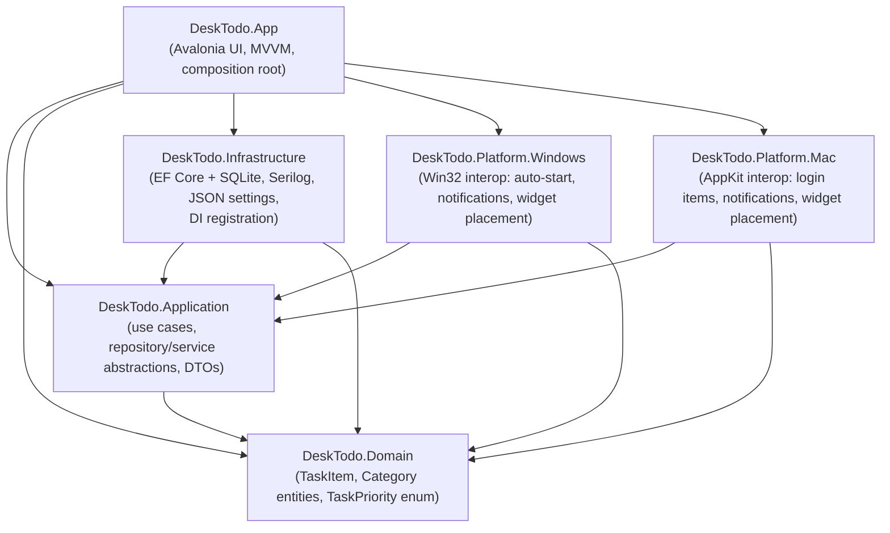

# DeskTodo — Architecture

## Layering

DeskTodo follows Clean Architecture. Dependencies point inward only —
outer layers reference inner layers, never the reverse. The Domain layer has
no dependencies on any other project or third-party framework.



`DeskTodo.Tests` references every layer, including `DeskTodo.App`, so
ViewModels can be unit tested directly.

## Why this shape

- **Domain** holds `TaskItem` and `Category` entities and the `TaskPriority`
  enum. It has zero package references — it compiles against nothing but
  the BCL — so it can be reused for a future Linux target, a CLI tool, or a
  test harness without dragging in Avalonia or EF Core.
- **Application** defines the *abstractions* the rest of the app depends on
  (`ITaskRepository`, `ICategoryRepository`) plus orchestration use cases
  (`ITaskService`/`TaskService`) — following the Repository pattern and
  Dependency Inversion Principle. Nothing in this layer knows about EF
  Core, Avalonia, or Win32/AppKit.
- **Infrastructure** implements the platform-agnostic abstractions: an EF
  Core `DbContext` backed by SQLite (repositories, migrations), Serilog
  configuration, and JSON-backed settings persistence.
- **Platform.Windows** / **Platform.Mac** implement the *platform-specific*
  abstractions from Application — auto-start/login-item registration,
  native notification integration, and desktop-level widget window
  placement. Both projects target plain `net10.0` (not `net10.0-windows`)
  so the cross-platform `App` project can reference both unconditionally;
  all OS-specific interop is guarded with `OperatingSystem.IsWindows()` /
  `OperatingSystem.IsMacOS()`. The DI composition root picks the correct
  implementation at startup based on the running OS — the UI layer never
  branches on platform itself. Adding Linux support later is a matter of
  adding `DeskTodo.Platform.Linux` and one more DI branch.
- **App** is the Avalonia MVVM presentation layer and composition root: it
  wires up Microsoft.Extensions.DependencyInjection and contains
  Views/ViewModels for every page (splash, widget, calendar, settings,
  about, update checker).

## Solution-level tooling decisions

- **Central Package Management** (`Directory.Packages.props`) pins every
  NuGet package version in one place so all seven projects stay in
  lock-step — no per-project version drift. It's also where a transitive
  dependency's version gets overridden when needed (see below).
- **`Directory.Build.props`** centralizes `Nullable`, `ImplicitUsings`,
  `LangVersion`, assembly metadata, and `GenerateDocumentationFile` for all
  non-test projects.
- **Classic `.sln` format** (not the newer `.slnx`) was chosen deliberately
  for broadest compatibility with Visual Studio, Rider, and MSIX/DMG
  packaging tooling on both target OSes.
- **`global.json`** pins the SDK to `10.0.200` with `rollForward:
  latestFeature` so CI and every contributor build with the same major/minor
  toolchain.
- **`SQLitePCLRaw.lib.e_sqlite3` is pinned to `3.53.3`** in
  `Directory.Packages.props`. `Microsoft.EntityFrameworkCore.Sqlite`
  10.0.10 pulls in version `2.1.11` of that package by default, which
  bundles a build of SQLite affected by
  [GHSA-2m69-gcr7-jv3q](https://github.com/advisories/GHSA-2m69-gcr7-jv3q)
  (fixed in SQLite 3.50.2+). Unlike its sibling `.core`/`.provider`/`.bundle`
  packages, `.lib.e_sqlite3`'s version number directly tracks the bundled
  SQLite version, so pinning just this one package (via CPM's transitive
  pinning) is enough to pull in a patched native SQLite build — confirmed
  via `dotnet restore` reporting zero `NU1903` warnings after the pin.

## A namespace collision worth knowing about

`DeskTodo.App`'s own namespace is a sibling of `DeskTodo.Application`
under the shared `DeskTodo` root. C#'s simple-name lookup resolves a
sibling namespace member (`DeskTodo.Application`, visible as `Application`
from inside `DeskTodo.App`) *before* it ever considers a `using` directive
for `Avalonia.Application` — including a `global using` alias, which is
resolved even later. The fix used throughout the App project is to fully
qualify the Avalonia type (`global::Avalonia.Application`) at the few
points that need it (see `App.axaml.cs`), rather than renaming either
project. This collision reproduces under any name pair shaped like
`X.App` / `X.Application`.

## UI pages (scaffolded, not yet implemented)

`DeskTodo.App/Views` and `ViewModels` reserve a folder per planned page:
`Splash`, `Widget` (the always-visible task widget itself — currently
`WidgetWindow`/`WidgetViewModel` at the Views/ViewModels root), `Calendar`
(day navigation / date picker), `Settings`, `About`, `UpdateChecker`.

## Core infrastructure and dependency injection

`DeskTodo.App/Program.cs` builds a `Microsoft.Extensions.Hosting` generic
host and hands off to Avalonia's classic desktop lifetime:

1. A Serilog **bootstrap logger** (console-only) is created first, so
   failures during host construction itself are still logged.
2. `Host.CreateDefaultBuilder(args)` is composed with:
   - `.UseDeskTodoLogging()` (`Infrastructure/Logging/SerilogHostingExtensions.cs`)
     — reads sinks/levels declaratively from the `"Serilog"` section of
     `appsettings.json` and adds a rolling daily file sink whose path comes
     from `AppStorageOptions` at runtime.
   - `AddInfrastructure(configuration)` (`Infrastructure/DependencyInjection/ServiceCollectionExtensions.cs`)
     — binds `AppStorageOptions` from the `"AppStorage"` config section and,
     when `RootDirectory` is left blank, defaults it via
     `AppStoragePaths.ResolveDefaultRootDirectory()` (`%LOCALAPPDATA%\DeskTodo`
     on Windows, `~/Library/Application Support/DeskTodo` on macOS).
   - `AddDeskTodoApp()` (`App/DependencyInjection/ServiceCollectionExtensions.cs`)
     — registers ViewModels; will grow as pages are added.
3. `host.Start()` (not `.Run()`) starts hosted services in the background
   without blocking, since Avalonia's `StartWithClassicDesktopLifetime`
   owns the actual blocking message loop.
4. `App.Services` (a static property, set only at this point) lets
   `App.OnFrameworkInitializationCompleted` resolve `WidgetViewModel` from
   the container — with a `new WidgetViewModel()` fallback so the XAML
   previewer still works at design-time.

Verified end-to-end: the built app creates
`~/Library/Application Support/DeskTodo/logs/desktodo-*.log` on macOS
(and the equivalent `%LOCALAPPDATA%\DeskTodo\logs\` on Windows), with both
console and file sinks receiving structured log entries.

Options binding is covered by
`tests/DeskTodo.Tests/Infrastructure/ServiceCollectionExtensionsTests.cs`,
which asserts both the OS-default path resolution and that an explicit
`AppStorage:RootDirectory` override is honored.

## Domain model and persistence

**No separate "day" entity.** `TaskItem.PlanDate` (a `DateOnly`) is which
day's list a task belongs to; there is no `DailyPlan`/day table. A day with
zero tasks is just zero rows with that `PlanDate` — "auto-create a new day"
needs no code at all, and there's no risk of a day-record and its tasks
drifting out of sync. `TaskItem.DayOrder` doubles as the displayed "task
number" (position + 1) and as the field drag-to-reorder writes to.

**No single "TaskStatus" enum.** Completed, Pinned, Archived and Deleted
are independent booleans (a task can be pinned *and* completed, archived
*and* pinned, etc.) — modeling them as one enum would force artificial
mutual exclusivity. Overdue is a computed property (`DueDate` in the past
and not completed), not stored state, since "is it overdue" changes with
the current time rather than through any user action.

**Named `TaskItem`, not `Task`**, to avoid colliding with
`System.Threading.Tasks.Task` — every repository/service method already
returns `Task<TaskItem>`, and `Task<Task>` would be exactly the kind of
same-name confusion the `DeskTodo.App`/`DeskTodo.Application` namespace
collision (above) is a cautionary tale about.

**A lightly rich domain model**: `TaskItem.Complete()`, `.Reopen()`,
`.Pin()`, `.Archive()`, `.SoftDelete()`, `.Restore()` encapsulate the
"toggle a flag and stamp `ModifiedAt`" logic in one place rather than
scattering it across `TaskService` and, later, ViewModels. `Delete` is a
soft delete (`IsDeleted`) so it stays recoverable — matching the "Undo" and
"recover unsaved edits" requirements — rather than removing the row.

**`ITaskRepository`/`ICategoryRepository` are per-aggregate, not a generic
`IRepository<T>`.** A generic repository over EF Core is widely considered
redundant (`DbSet<T>` already *is* a generic repository) and tends to leak
either too little (forcing `IQueryable<T>` back out through the
abstraction, defeating the point of the abstraction) or too much. Each
method here is a **self-contained unit of work** — it persists immediately
rather than exposing a separate `SaveChangesAsync` — because Infrastructure
creates a new, short-lived `DeskTodoDbContext` per call via
`IDbContextFactory<DeskTodoDbContext>` rather than sharing one context for
the app's lifetime. That's the EF Core–recommended pattern for WPF/Avalonia-style
long-running desktop processes: a single shared `DbContext` both isn't
thread-safe and would let its change tracker grow unbounded for the life of
the process. One consequence worth knowing: `TaskRepository.UpdateAsync`
sets `context.Entry(task).State = EntityState.Modified` rather than calling
`DbSet.Update(task)`, because `Update()` walks the *entire reachable object
graph* — a task fetched via `GetByDateAsync` (which `.Include()`s
`Category`) would otherwise also attach and mark the related `Category` row
as modified.

**Categories are entities, not an enum**, since each needs its own
user-visible color and users can create custom ones (`Category.IsBuiltIn`
distinguishes the seven seeded defaults — Personal, Office, Learning,
Fitness, Shopping, Finance, Family — from user-created categories; only the
latter can be deleted). The seven defaults are seeded via EF Core's
`HasData` in `CategoryConfiguration`, keyed by fixed `Guid`s (not
`Guid.NewGuid()`, which would create a new "seed" on every model build and
churn the migration).

**Migrations** are checked in under `Infrastructure/Data/Migrations/` and
applied automatically on startup (`DatabaseInitializer.MigrateDeskTodoDatabaseAsync`,
called from `Program.cs` right after `host.Start()`) — this is what "support
automatic migrations" means in practice: no manual `dotnet ef database
update` step for end users. The EF Core CLI itself is pinned as a
**local** tool (`.config/dotnet-tools.json`, restored via `dotnet tool
restore`) rather than assumed to be globally installed, so any contributor
gets the exact same tool version. Generating a new migration:

```bash
dotnet tool restore
dotnet ef migrations add <Name> \
  --project src/DeskTodo.Infrastructure/DeskTodo.Infrastructure.csproj \
  --startup-project src/DeskTodo.App/DeskTodo.App.csproj \
  --output-dir Data/Migrations
```

Note `DeskTodo.App.csproj` carries its own `Microsoft.EntityFrameworkCore.Design`
reference (in addition to Infrastructure's) even though the `DbContext`
lives in Infrastructure — the EF Core CLI requires the Design package to be
visible from the *startup* project specifically, and Infrastructure's
reference is `PrivateAssets="all"` so it doesn't flow transitively.

The EF CLI's design-time tooling also deliberately throws
`HostAbortedException` after it captures the host's service provider (e.g.
while generating a migration) — `Program.cs` rethrows that one specific
exception type without Serilog `Fatal`-level logging, so running `dotnet
ef` doesn't look like the app crashed.

Verified end-to-end, not just unit-tested: running the built app creates
the SQLite file (`desktodo.db`) at the resolved `AppStorageOptions` path,
applies the migration, and seeds all seven categories — confirmed by
querying the live database file directly with the `sqlite3` CLI.

## Widget UI

`WidgetWindow` is the always-visible window: today's day-of-week/date
header, a live task list, and a completion progress bar. Scope for this
phase is deliberately display + complete/reopen only — full CRUD (create,
edit, pin, archive, drag-reorder) is the next phase; desktop-level window
attachment (sitting behind icons, above wallpaper), click-through view
mode, and remembering window position/opacity are later phases
(Platform integration, Settings). What's here now:

- **Borderless, rounded, draggable shell**: `WindowDecorations="None"` with
  a rounded `Border` as the visible "card" (the `Window` itself stays
  `Background="Transparent"` with `TransparencyLevelHint="Transparent"` —
  without that hint, the window's rectangular frame stays opaque outside
  the border's rounded corners). Since there's no title bar, the header
  area itself calls `BeginMoveDrag` on pointer-press — the standard
  Avalonia pattern for moving chromeless windows. A small close button is
  the only other chrome; a tray icon (the more permanent way to reach a
  borderless widget) is a Settings-phase concern.
- **`TaskItemViewModel`** wraps each `TaskItem` for the list, mapping
  `Priority` to a color-coded dot and exposing `IsCompleted` for display.
- **`WidgetViewModel`** loads today's list via `ITaskService`, tracks
  completed/total counts (recomputed whenever any row's `IsCompleted`
  changes, via a `PropertyChanged` subscription per item), and polls every
  30 seconds to catch the day rolling over past midnight — polling rather
  than scheduling one timer for exactly midnight so a sleeping/suspended
  machine still catches the rollover soon after waking.

### A binding footgun this phase ran into (and fixed)

`TaskItemViewModel`'s constructor originally did `IsCompleted =
task.IsCompleted;` to seed the display value from the freshly-loaded
entity. CommunityToolkit.Mvvm's `[ObservableProperty]`-generated setter
calls its `On<Property>Changed` partial hook **unconditionally, including
from the constructor** — so wiring persistence into that hook (`partial
void OnIsCompletedChanged(...) => _ = PersistCompletionAsync(...)`) meant
*every task load re-persisted each task's own just-loaded state back to the
database*, wastefully and asynchronously, immediately after loading it.
This was caught by actually running the app with seeded data and watching
the log — not by the build or the test suite, since nothing about it was
type-incorrect. The fix: `IsCompleted`'s setter is now purely for display,
and a `[RelayCommand] ToggleCompleteAsync` — bound to the row's `CheckBox`
via `Command`, with `IsChecked` bound `Mode=OneWay` rather than the default
`TwoWay` — is the only path that persists, and it only ever runs from a
genuine user click. `TaskItemViewModelTests.Constructor_NeverPersistsTheJustLoadedState` asserts
this with Moq (verifying `ITaskRepository.UpdateAsync` is never called
during construction) so it can't silently regress.

Relatedly, `WidgetViewModel`'s constructor originally also did `_ =
LoadTasksAsync();` (fire-and-forget) to kick off the initial load.
Constructors starting async work they don't own is a separate known smell
— nothing external can await or sequence with it, which made it race
against an explicit `await viewModel.LoadTasksAsync()` in tests. That call
was removed from the constructor; `WidgetWindow.OnOpened` triggers the
initial load instead (matching how Avalonia already fires `Opened` when a
window is shown), leaving `WidgetViewModel` free of any self-initiated
async work.

## Headless visual verification

This development environment has a real display attached but can't grant
the running process macOS's Screen Recording permission (`screencapture`
fails with "could not create image from display" regardless), so no
amount of retrying gets a real screenshot of a live window. Instead,
`tests/DeskTodo.Tests/Views/WidgetWindowRenderTests.cs` drives Avalonia's
own headless rendering platform (`Avalonia.Headless`) — it renders the
actual compiled XAML to an in-memory bitmap without touching any OS
display/capture API at all, so it works identically whether or not a
display (or permission to capture it) exists. This is also just a
generally useful thing to have: it catches binding/converter/XAML errors
that only surface at runtime — like the constructor-persistence bug above
— automatically, in CI, on every change, which a build or a plain
ViewModel-level unit test cannot.

`Avalonia.Headless.XUnit` (the package that provides `[AvaloniaFact]`)
is deliberately **not** used — it depends on `xunit.v3`, which conflicts
(ambiguous `FactAttribute`) with the `xunit` v2 packages the rest of the
test project is built on, and migrating the whole suite to v3 wasn't
worth it just for two UI tests. `Avalonia.Headless` alone provides
`HeadlessUnitTestSession`, which is driven manually instead:
`HeadlessSessionFixture` starts one shared session (`[CollectionFixture]`,
since spinning up Avalonia's platform/dispatcher thread per test would be
wasteful) via `HeadlessUnitTestSession.StartNew(typeof(TestAppBuilder))`,
and each `[Fact]` runs its body through `session.Dispatch(async () => {
... }, cancellationToken)`. `TestAppBuilder.BuildAvaloniaApp()` configures
`.UseSkia().UseHeadless(new AvaloniaHeadlessPlatformOptions {
UseHeadlessDrawing = false })` — real Skia rendering into an off-screen
buffer, rather than the (default) drawing-free stub that only tracks
layout without actually producing pixels — and configures against the
real `App` class (not a minimal stand-in) specifically so `FluentTheme`
applies; without it, controls like `CheckBox` and `ProgressBar` would
render with no template at all.

`window.CaptureRenderedFrame()` returns the rendered `WriteableBitmap`;
the test asserts it's non-empty and, only when the `DESKTODO_SCREENSHOT_DIR`
environment variable is set (so this has zero effect in CI or a normal
`dotnet test` run), saves it as a PNG for manual inspection. That's how
the widget's actual rendered appearance — header, strikethrough on
completed tasks, priority-color dots, progress bar, the pin glyph's emoji
font fallback, the "Add a task…" row — was confirmed to match the intended
design during development, not just assumed from the XAML.

## Task CRUD

Builds directly on the Widget UI phase's `TaskItemViewModel`/`WidgetViewModel`
rather than introducing new ones. New per-task operations — rename,
duplicate, pin/unpin, archive, delete — are `[RelayCommand]`s on
`TaskItemViewModel`, following the same "component owns persisting its own
state" shape as the existing `ToggleCompleteCommand`. Creating a task is a
`[RelayCommand]` on `WidgetViewModel` instead, since there's no existing
row to own it (an "Add a task…" `TextBox` at the top of the list, Enter to
submit).

**Delete/duplicate/archive change *which* tasks belong on today's list**
(a deleted or archived task should disappear from view; a duplicated task
introduces a new row) — `TaskItemViewModel` doesn't try to patch
`WidgetViewModel.Tasks` itself for these. It calls a `requestListRefresh`
callback (injected via constructor: `() => _ = LoadTasksAsync()`) that
triggers a full reload from `ITaskService` instead. This trades a bit of
efficiency (a full re-query instead of a targeted collection edit) for
correctness and simplicity — no risk of the ObservableCollection drifting
out of sync with the database, no manual index-tracking bugs. For a
personal-scale todo list (dozens, not thousands, of tasks per day) that
trade-off is the right one; complete/reopen/pin/rename don't need it since
those never change list *membership*, only in-place row state.

Inline title editing (double-click the title, matching the "Double click
to edit / Enter confirms / Escape cancels" requirement) is implemented as
two overlapping elements in the row template — a `TextBlock` (`IsVisible`
bound to `!IsEditing`) and a `TextBox` (`IsVisible` bound to `IsEditing`)
— rather than a single element that swaps its own editability, since
Avalonia's `TextBox` and `TextBlock` are different control types. Commit
(Enter) and cancel (Escape) are wired via a `KeyDown` handler in
`WidgetWindow.axaml.cs` rather than `KeyBinding`s, since the binding needs
to reach the specific row's `TaskItemViewModel` (`sender`'s `DataContext`),
not a window-wide command. **Not implemented**: auto-focusing the edit
`TextBox` when edit mode begins — doing that correctly for an element
inside a templated `ItemsControl` needs either an attached
behavior/focus-helper or `Avalonia.Xaml.Behaviors`, neither of which
seemed worth adding for one focus call at the time; solved properly in
Phase 9 below without needing either.

**Not implemented in this phase**, picked up in Phase 9: drag-to-reorder
and full multi-field editing. Bulk select/delete/complete and
copy/paste/undo/redo remain scoped to the later Search/filter/sort phase.

## Phase 9 — drag-to-reorder and the full-field task editor

**Drag-to-reorder** uses Avalonia's actual `DragDrop` API (not a hand-rolled
pointer-position tracker) for correct visual feedback and `DragOver`/`Drop`
routing, but deliberately does *not* route the dragged task's `Guid`
through Avalonia 12's new `IDataTransfer`/`DataFormat`/`DataTransferItem`
payload system. That system is built for drags that can leave the
originating control (or the process) — files onto the app, text into
another app — which needs a serializable, format-negotiated payload. This
drag never leaves the window it started in, so a private `Guid?
_draggedTaskId` field on `WidgetWindow`, set before `DragDrop.DoDragDropAsync`
and read in the `Drop` handler, is simpler and just as correct; an empty
`DataTransfer` instance satisfies the API's required parameter without
carrying anything. A dedicated drag-handle glyph (⠿) per row — rather than
making the whole row draggable — avoids fighting the checkbox click,
double-click-to-edit, and context-menu gestures already living there.
`WidgetViewModel.ReorderAsync` removes the dragged id from its current
position and reinserts it at the drop target's *current* index (re-found
after removal, since it shifts down by one if the drop target originally
came after the dragged item), then persists via the reorder plumbing that
already existed from the persistence phase and reloads.

**The full-field editor** is a separate `TaskEditWindow`/`TaskEditViewModel`
pair, shown as a modal dialog (`ShowDialog(this)`) from `WidgetWindow`,
rather than growing the widget's own row template further. `TaskItemViewModel`
doesn't construct or show it directly — ViewModels constructing Views
breaks testability — so `OpenEditorCommand` just calls a
`requestFullEdit(Guid)` callback (mirroring `requestListRefresh`'s
established shape), which `WidgetViewModel` re-raises as a public
`TaskEditRequested` event for `WidgetWindow`'s code-behind to handle.
`ITaskService` gained one addition, `GetTaskAsync(Guid)`, purely so the
editor's ViewModel only depends on `ITaskService` for task data (it also
depends on `ICategoryRepository` directly, but only to populate the
category dropdown — a plain read with no business logic, so routing it
through the service layer would just be ceremony). The context menu's
"Edit" item now opens this full editor; double-clicking the title still
does the lightweight inline rename from the Task CRUD phase — they're
different weights of the same underlying action, not a redundancy.

Two real bugs surfaced by actually running this rather than just building
it:

- **A headless-test threading race.** Adding two new test files pushed
  xUnit's default cross-collection parallelism into racing against
  `Avalonia.Headless`'s one-time, global `AppBuilder.SetupUnsafe()`
  compositor/dispatcher initialization, intermittently throwing "the
  calling thread cannot access this object because a different thread
  owns it." `tests/DeskTodo.Tests/xunit.runner.json` sets
  `parallelizeTestCollections: false` — cheap for a 49-test suite, and the
  only correct fix for a genuinely global, non-reentrant one-time setup
  call. Confirmed fixed by running the suite 3 times in a row after the
  change (it wasn't flaky-not-reproducing before the fix — it failed the
  same way twice, then reliably passed after).
- **A DatePicker/NumericUpDown layout collision** — the editor's Due
  date/Estimated minutes row put a 3-segment `DatePicker` (month/day/year)
  into a half-width column of a 360px-wide window, and it visually
  collided with the `NumericUpDown` next to it (the DatePicker's own
  "day" segment came out blank in the rendered screenshot, with the
  NumericUpDown's spinner arrows bleeding into where "year" should have
  been). Neither the build nor any test caught this — it's a pure layout
  issue, invisible to anything that doesn't actually render the window.
  Only visible by looking at the headless-rendered screenshot, which is
  exactly why that capability was built in the Widget UI phase. Fixed by
  giving each control its own full-width row instead of sharing one.

## Phase 10 — daily planner and calendar navigation

No data-layer changes were needed: `TaskItem.PlanDate` already scopes
tasks to a day (see the persistence phase's "no separate day entity"
decision), so "navigate to a different day" is just "call
`GetTasksForDateAsync` with a different `DateOnly`" — the same method the
widget already called for "today."

**Previous/Today/Next** are plain `[RelayCommand]`s on `WidgetViewModel`
that funnel into one `NavigateToAsync(DateOnly)` helper — it updates
`PlanDate`, raises `PropertyChanged` for every property derived from it
(`DayOfWeekText`, `DateText`, `IsToday`, `EmptyStateText`, `SelectedDate`),
and reloads. **Jump to any date** uses `CalendarDatePicker` (not a plain
`Calendar` control in a hand-rolled popup) specifically because it already
*is* a compact "click to open a calendar, shows the picked date" widget —
building that combination manually would have just reimplemented what the
control already does. Its `SelectedDate` (`DateTime?`) is bound two-way to
a `WidgetViewModel.SelectedDate` property; unlike the command-driven
buttons, this can't be a `[RelayCommand]` because Avalonia's data-binding
engine needs a plain synchronous CLR property setter, so the setter starts
`NavigateToAsync` fire-and-forget.

**Midnight rollover now distinguishes "was showing today" from "was
showing some other day."** The original Widget UI phase's rollover timer
simply compared `PlanDate` to the current date and jumped whenever they
differed — correct when the widget could only ever show today, wrong now
that the user can deliberately navigate to yesterday or next week: at
midnight, `PlanDate` (yesterday) and the new "today" would differ, and the
old logic would incorrectly yank the view back to today out from under
someone reviewing history or planning ahead. Fixed by tracking
`_lastKnownToday` separately from `PlanDate` — the timer only forces
`PlanDate` forward when it still equals the *previous* `_lastKnownToday`
(i.e. the widget was actually following today, not parked somewhere
else). This exact interaction — a real-time timer callback whose behavior
depends on `DateTime.Now` — was also, at the time, the one piece of this
phase without a unit test: there was no injected clock (`TimeProvider`) to
fake against, and adding one felt disproportionate for one `if`-branch in
isolation. Closed out afterward, once it was worth doing properly — see
Phase 12 below for the actual `TimeProvider` migration and the tests it
unlocked.

## Phase 11 — search / filter / sort / multi-select

**`VisibleTasks` is a derived view over `Tasks`, not a second source of
truth.** `Tasks` stays the full day's list loaded from the database (in
`DayOrder`); `RefreshVisibleTasks()` filters/sorts it into `VisibleTasks`
on every change to search text, status filter, category filter, or sort
option — the row `ItemsControl` binds to `VisibleTasks`. This keeps every
keystroke and filter change a pure in-memory recompute instead of a fresh
DB query, appropriate at personal-task-list scale. Drag-to-reorder's
`ReorderAsync(draggedId, targetId)` already worked by task ID against
`Tasks`, not list index, so pointing the row list at `VisibleTasks` instead
needed no changes there — ID-based lookup is filter/sort-agnostic.
Completion progress (`CompletedCount`/`TotalCount`/`ProgressPercentage`)
deliberately still reflects the *whole* day (`Tasks`), not the filtered
subset — the point of the progress bar is "how much of today is done,"
which shouldn't wobble depending on what's currently being searched for.

**`IsSelectModeActive` is cascaded onto each row, not ancestor-bound.**
The row template's `DataContext` is `TaskItemViewModel`, but "is the widget
currently in multi-select mode" is `WidgetViewModel` state. Rather than
reach across with Avalonia's `$parent[Window]` ancestor-binding syntax (a
fragile last resort), `TaskItemViewModel` gets its own `IsSelectModeActive`
property, and `WidgetViewModel.ToggleSelectMode()` (and `LoadTasksAsync`'s
row construction) pushes the flag down onto every row. The row template
then does a plain same-DataContext binding to decide whether to show the
drag-handle glyph or the selection checkbox in its first column.

**A real bug, only catchable by actually rendering the window.** Loading
categories (`RefreshCategoriesAsync`, called on every `LoadTasksAsync` —
i.e. every day-navigation) originally rebuilt the `Categories`
`ObservableCollection` by calling `Clear()` and then re-`Add()`-ing each
entry. ViewModel-level tests couldn't see any problem — by the time
`RefreshCategoriesAsync` returned, `SelectedCategoryFilter` was correctly
re-set to a valid item, and `Categories` correctly contained it. But the
`Clear()` call momentarily removes the *currently-selected* item from the
collection the search bar's category `ComboBox` is bound to. Avalonia's
`ComboBox` reacts to that by desyncing its two-way `SelectedItem` binding —
`SelectedIndex` sticks at `-1` and the closed box renders with no text,
*even after* the list is repopulated with an equal item and the ViewModel
property is correctly reassigned. The fix updates `Categories` in place
(add anything new, remove anything stale, replace anything renamed)
instead of ever clearing it outright, so the selected item is never
observably absent from the bound collection. This was invisible to every
ViewModel-only test and only surfaced via a headless-render test asserting
`ComboBox.SelectedIndex != -1` after a second load (simulating
day-navigation) — now a permanent regression test
(`WidgetWindow_CategoryFilterComboBox_StaysSelected_AcrossReloads`) since a
plain visual screenshot comparison wouldn't reliably catch a state that's
merely "no visible text," and a ViewModel test structurally can't see it at
all (the bug lives entirely in the View-layer `ComboBox`'s internal
selection state).

## Phase 12 — settings

**Scoped to what the widget can concretely apply today, not the phase's
full original wishlist.** IMPLEMENTATION.md's Phase 12 entry originally
listed theme (light/dark/auto), accent color, transparency, font/widget
size, auto-start, notifications, database location, backups, shortcuts,
language and date/time format. Most of those need a *system* that doesn't
exist yet: light/dark theme needs every hardcoded hex color in
`WidgetWindow.axaml`/`TaskEditWindow.axaml` turned into a themed resource
(a real, separate pass, not settings plumbing); auto-start needs Phase 15's
platform integration; notifications need Phase 13; backups need Phase 14;
shortcuts need a hotkey system that doesn't exist; language needs i18n
infrastructure. Shipping settings for features that don't do anything yet
is just dead UI. This pass covers accent color, background opacity, and
remembered window position/size — three settings with a real, already-
existing piece of UI to attach to.

**Accent color is a resource override, not a XAML binding.** Avalonia's
Fluent theme threads `SystemAccentColor` through default control accenting
(the progress bar fill, checkbox checked state) automatically, with zero
per-control styling needed in `WidgetWindow.axaml`. `App.ApplyAccentColor`
sets `Application.Current.Resources["SystemAccentColor"]` directly — an
app-wide side effect, so it lives in the App/View layer (`App.axaml.cs`,
called again from `WidgetWindow`'s Settings-dialog handler after Save),
never in a ViewModel, which shouldn't reference Avalonia types. This was
verified empirically via headless screenshot (not assumed) before trusting
it: the checkbox and progress bar both visibly picked up a custom pink
accent with no other changes, confirming the resource cascades correctly
in this Avalonia version/theme.

**Widget opacity only fades the background, not the text**, matching how
desktop widgets like Rainmeter/Sticky Notes handle transparency: it's
blended into the outer `Border`'s alpha channel
(`WidgetViewModel.WidgetBackgroundHex`, reusing the existing
`HexColorToBrushConverter`) rather than the whole `Window.Opacity`, which
would fade foreground text along with the background and make it
progressively less readable. Verified via headless screenshot at 45%
opacity — secondary gray text (`#64748B`/`#94A3B8`) does get harder to read
against the artificial flat-gray test backdrop at low opacity, an inherent
tradeoff of fixed-color text on a translucent surface (not unique to this
implementation), noted rather than "fixed" with adaptive text color, which
would need the same themed-resource work theme support is deferred for.

**Window bounds are restored *before* the window's first paint, not in
`OnOpened`.** Settings (including window position/size) are loaded
synchronously (`LoadSettingsAsync().GetAwaiter().GetResult()`) in
`App.axaml.cs`, before `WidgetWindow` is even constructed — the same
blocking-async-during-startup pattern `Program.cs` already uses for the
database migration. Doing this later, in `WidgetWindow.OnOpened`, would
show the window at its default center-screen position and default accent
color first, then visibly jump/flash once the (asynchronous, real file I/O)
settings load completed. Saving bounds back happens in `OnClosing` (not
`OnClosed`, where `Position`/`Width`/`Height` are no longer meaningful to
read), also blocking briefly rather than fire-and-forget, since a
fire-and-forget write during shutdown risks losing the write to process
exit.

**Avoiding a sibling of Phase 11's `Categories`-collection bug by design.**
Given Phase 11's `Categories`-`Clear()`-desyncs-a-`ComboBox`
lesson, `SaveWindowBoundsAsync` and `SettingsViewModel.SaveAsync` both
reload the full `AppSettings` from disk immediately before mutating and
resaving it, rather than serializing a ViewModel's own partial in-memory
copy — so a concurrent edit in one window (e.g. accent color changed in
Settings while the widget itself is about to persist window bounds on
close) can't silently clobber the other's field. Two independent windows
writing to the same JSON file is a small-scale version of the same
"don't let a write blow away state it doesn't own" problem.

### Closing two verification gaps

**The "window-bounds-on-close needs a real display" assumption was wrong.**
It was first written off as untestable — surely triggering a window's
native close gesture needs either a real display or accessibility
automation, neither available in this sandbox. That assumption turned out
to be about the wrong layer: `WidgetWindow.OnClosing`/`OnClosed` are
Avalonia's own C# lifecycle methods, invoked by `Window.Close()` itself —
they run identically whether `Close()` is triggered by a real OS close
button or called programmatically, and headless already runs that same
lifecycle for `Show()`/`OnOpened` (that's how earlier phases tested
initial-load behavior at all). Verified with a throwaway test before
trusting it: constructing a `WidgetWindow`, setting `Width`/`Height`, and
calling `window.Close()` under headless did invoke `OnClosing` and read
back the exact values set (`Position` was the one exception — the headless
backend overrides whatever is explicitly assigned to its own placement, so
the permanent test captures whatever `Position` actually is right before
`Close()` rather than asserting a hardcoded value, to not couple the test
to that backend detail). `WidgetWindow_OnClosing_PersistsCurrentWindowBounds`
now exercises the real close path end-to-end — confirmed to actually catch
a regression, not just pass trivially, by temporarily gutting the
`OnClosing` override and watching the test fail before restoring it.

**The midnight-rollover test gap (from Phase 10) is now closed the way
that section originally said it should be: a `TimeProvider` migration.**
Every "what day is it right now" query in `WidgetViewModel`
(`_lastKnownToday`'s initial value, `IsToday`, `GoToToday`,
`OnDayRolloverTick`) now goes through one `Today()` helper backed by an
injected `TimeProvider`, registered as `TimeProvider.System` in DI —
`DateTime.Now` no longer appears anywhere in the class. `OnDayRolloverTick`
became `internal` (with a matching `InternalsVisibleTo` in
`src/DeskTodo.App/AssemblyInfo.cs`) specifically so tests can invoke it
directly against a fake `TimeProvider`, rather than needing to wait on the
real 30-second `DispatcherTimer` or the actual wall clock. The fake
provider pins `LocalTimeZone` to UTC (overriding the virtual property
Avalonia — and the BCL's `TimeProvider` base class — expose for exactly
this) so the tests' chosen date/time literals can't land on a different
calendar date depending on the machine's local timezone; `Today()` calls
`GetLocalNow()`, not `GetUtcNow()`, matching what a real desktop widget
should show (the user's local day). Three tests now cover the logic
directly: advances when the widget was following today, stays put when
parked on a different day (verified to catch the original bug — the
`wasFollowingToday` check specifically — by breaking it and watching the
test fail), and no-ops when the date hasn't actually changed between polls.

## Phase 13 — notifications

**Shelling out beats P/Invoke here, and the Mac half proves it.** Both
platform notification services (`MacNotificationService`,
`WindowsNotificationService`) launch a short script via `Process.Start`
(`osascript`/PowerShell) rather than binding native notification APIs
directly. The alternative — `Shell_NotifyIcon` on Windows,
`NSUserNotificationCenter`/`UNUserNotificationCenter` on macOS — needs
either a persistent message-only window (Win32) or Objective-C runtime
interop and, for the modern `UNUserNotificationCenter` API, a registered app
bundle identity that an unpackaged dev build doesn't have. Shelling out to
an OS-provided scripting facility sidesteps all of that, at the cost of a
process-launch per notification — negligible for "a few times a day."
This wasn't just assumed to be fine: `osascript -e 'display notification'`
was run for real in this dev environment *before* any of
`MacNotificationService` was written, confirming it needs no permission
prompt from a plain unsigned process. The equivalent Windows path is
authored the same way for consistency but is **not** runtime-verified —
see "What's genuinely verified vs. authored-only" below.

**AppleScript/PowerShell string construction gets the same injection
scrutiny as SQL.** A task title becomes part of a script's source text
(`display notification {title} with title {title}`), so
`MacNotificationService.AppleScriptString` escapes backslashes and double
quotes before interpolating — otherwise a title like
`" & do shell script "..."` would let arbitrary shell commands run via
AppleScript's `do shell script`. This is exercised by a real test
(`NotifyAsync_AttemptedAppleScriptInjection_IsTreatedAsLiteralText`) that
attempts exactly that and asserts the injected command's side effect (a
canary file) never happens — not just that the call doesn't throw.

**The daily summary and overdue-check share one timer, not two.**
`WidgetViewModel`'s existing 30-second `DispatcherTimer` (originally just
for midnight rollover, see Phase 10) gets a second `Tick` subscriber,
`OnNotificationCheckTick` — event delegates are multicast, so this needed
no new timer or restructuring of the existing rollover logic. The overdue
check runs every tick (independent of whether the day actually rolled
over); the daily summary is checked from `LoadTasksAsync` instead (so it
also fires on a normal morning app-open, not only if the app happens to
already be running at midnight) and is guarded by
`_lastDailySummaryDate`/`_notifiedOverdueTaskIds` — both session-only, reset
on restart, which is an acceptable simplification since re-notifying once
after a restart isn't harmful and persisting them would need their own
storage for little benefit.

## Phase 14 — import / export

**One flat DTO (`TaskExportRecord`), not the EF entity, crosses the
format boundary.** CSV/JSON/Markdown/Excel writers and the CSV/JSON readers
all consume/produce `TaskExportRecord`, never `TaskItem` directly — category
is carried by *name*, not `CategoryId`, since a Guid means nothing once it
leaves this specific SQLite file (re-importing into a different DeskTodo
install matches by name instead, falling back to uncategorized on no
match). This also means the export/import services have zero dependency on
the Domain layer.

**A hand-rolled CSV parser, not `Split(',')`, and not a new dependency.**
Notes/Description fields can contain the commas, quotes and newlines that a
naive split would corrupt — exactly the characters
`TaskExportService`'s writer quotes for that reason. Rather than pull in a
CSV library for ~130 lines of parsing, `TaskImportService.ParseCsv` is a
small explicit state machine (quoted-field tracking, doubled-quote
escaping). Verified with a real round-trip test using a title containing a
comma *and* a multi-line Notes field with embedded quotes — not just typed
by inspection.

**ClosedXML over EPPlus for the one format that does need a library.**
EPPlus's license changed to require a paid commercial license for anything
beyond noncommercial use as of v5 — ClosedXML (MIT) has no such
restriction. The Excel writer test doesn't just check "did `SaveAs` throw"
— it re-opens the saved stream with `ClosedXML.Excel.XLWorkbook` and reads
specific cells back, proving the file is a genuinely valid, readable
workbook, not merely non-empty bytes.

**Known verification gap, structurally unavoidable, not just unattempted:**
`ImportExportWindow`'s file-picker code-behind
(`StorageProvider.SaveFilePickerAsync`/`OpenFilePickerAsync`) can't be
exercised under Avalonia's headless test platform — unlike the `OnClosing`
gap from Phase 12 (which turned out testable once the wrong assumption was
found and corrected), this one is real: headless has no fake
`IStorageProvider` to inject a picked file into, so there's no way to drive
a native OS dialog without an actual display and user interaction. Every
piece on either side of that dialog — `ImportExportViewModel`'s methods
(given a real `Stream`) and the export/import services (given a real file)
— is fully tested; only the thin glue that hands a picked file's stream
to the ViewModel is not.

## Phase 15 — platform integration

**`IAutoStartService.IsEnabled` reads the real OS state, not a persisted
flag.** `AppSettings` deliberately has no `AutoStartEnabled` field — the
LaunchAgent plist's presence (macOS) or the registry value's presence
(Windows) *is* the state, and `SettingsViewModel.LoadAsync` reads it
directly from `IAutoStartService.IsEnabled` each time the Settings window
opens. A persisted duplicate flag could drift from reality (e.g. if the
user deleted the LaunchAgent by hand, or a previous version's registration
got corrupted); reading the actual OS state can't drift, by construction.

**`MacAutoStartService.Enable()` is a plain file write, deliberately not a
`launchctl load` call — which is exactly what keeps it safely testable.**
Actually activating a LaunchAgent for the *current* login session would
need `launchctl bootstrap`/`load` against the real user's session — real,
live system state outside this repo that a test run has no business
touching. Writing the plist file alone is enough for the durable outcome
that matters ("will auto-start at next login"; macOS auto-loads any
LaunchAgent plist present at login with no extra registration step) and
means `MacAutoStartServiceTests` can safely construct the service against
a scratch temp path (via an `internal` constructor overload,
`InternalsVisibleTo`-exposed to the test assembly) and exercise real
`Enable()`/`Disable()`/`IsEnabled` file I/O without ever touching the real
`~/Library/LaunchAgents`. The tradeoff — enabling auto-start doesn't take
effect until the next login, not immediately — is stated in the toggle's
doc comment, not hidden.

**Desktop-level widget window placement was scoped out, and that call was
put to the user rather than made silently.** Sitting the widget behind
desktop icons (like Rainmeter) needs raw native interop on both platforms —
Objective-C runtime calls to set `NSWindow.level` on macOS, reparenting to
the desktop's hidden `WorkerW` window via Win32 messaging on Windows — with
no way to verify either here: no live compositor/display session to
visually confirm placement even exists in this sandbox, and a wrong
selector or window-level constant risks crashing the window outright rather
than just failing quietly (unlike, say, a notification call that just
silently doesn't show anything if slightly wrong). Given the explicit
"complete all the phases" instruction this diverges from, this was framed
as a direct question rather than a unilateral scoping call the way smaller
decisions (e.g. Phase 11's "search by date") were — the user confirmed
skipping it.

## Phase 17 — checklists & task templates

**`TaskTemplate.ChecklistItems` is a manual JSON-string conversion, not
EF Core's newer built-in primitive-collection-to-JSON mapping.** EF Core
can map a `List<string>` column to JSON natively in recent versions, but
whether that support behaves correctly against the exact SQLite provider
version this project pins wasn't verified, and a hand-rolled
`JsonSerializer.Serialize`/`Deserialize` `HasConversion` (with an explicit
`ValueComparer` so EF Core's change tracker can tell when the list actually
changed) is unambiguous and has worked in EF Core/SQLite for years — the
same "don't take an unverified API on faith" discipline as the
`ShowInTaskbar` investigation below, applied at design time instead of
after the fact.

**Checklist items persist immediately, per action — there's no staged
"Save" for them the way Title/Priority/Category still work in the
full-field editor.** Add/toggle/remove each call `IChecklistService`
directly and update the row list in place. This matches every other
row-level mutation in the app (Pin, Complete, Delete, ...) and avoids a
"did my checklist edits actually save" ambiguity if the editor window is
closed via the OS close button rather than Save/Cancel. Tags (Phase 18)
follow the same immediate-persistence rule for the same reason.

**Seven starter templates are seeded via `TaskTemplateConfiguration.HasData`,
one per built-in `Category`, using the same fixed-GUID pattern
`CategoryConfiguration`'s seeded categories already established.** Without
this, "New from template" is an empty dropdown until a user manually saves
their first one — a worse first-run experience than Category's own seeded
rows already avoid. They're ordinary rows once seeded (no `IsBuiltIn`-style
flag the way `Category` has one): a template is just a saved shape with no
behavior that needs to distinguish "shipped with the app" from "a user
saved this," so a user can freely rename, edit, or delete any of them.

## Phase 18 — tags & task color

**Tags use EF Core's implicit many-to-many (skip navigations), not an
explicit `TaskTag` join-entity class.** `Tag.Tasks`/`TaskItem.Tags` plus
`HasMany(...).WithMany(...).UsingEntity(j => j.ToTable("TaskTags"))` is
enough — there's no extra data on the join itself (no "added at" timestamp
per assignment, no ordering), so a join entity would just be ceremony EF
Core's own modern many-to-many support already avoids needing.

**Group By shipped as an extra `TaskSortOption` (`Category`), not a
grouped-list UI with header rows.** Sorting by category name visually
clusters same-category tasks together — the actual user-visible outcome —
without `WidgetViewModel.RefreshVisibleTasks` needing to switch
`VisibleTasks` from a flat `ObservableCollection<TaskItemViewModel>` to a
heterogeneous header/item collection. That's a materially bigger change
whose ripple effects (drag-to-reorder, bulk-select, `HasNoTasks`, the
`ItemsControl`'s `DataTemplate`) every existing consumer of `VisibleTasks`
would need to account for, for a feature whose actual ask — "make
same-category tasks sit together" — the sort-mode approach already
satisfies. True header-row grouping (and grouping by priority/tag/due-date)
is still open if a future pass specifically wants it.

**The widget row's priority-colored dot now shows `TaskItem.ColorHex` when
set, falling back to the priority color otherwise.** `ColorHex` existed on
`TaskItem` since an earlier phase but had no UI to set *or display* it —
cross-referencing `Later.Implementation.md` surfaced that gap. Wiring the
color picker without also wiring its display would have shipped a setting
with no visible effect, so `TaskItemViewModel.DisplayColorHex` was added
alongside the picker itself.

## Phase 19 — recurrence & auto-reschedule

**`TaskItem.GetNextOccurrencePlanDate()` is a pure computation; creating
the next occurrence's row is `TaskService.CompleteTaskAsync`'s job, not the
Domain entity's.** The Domain layer computes *what date* the next
occurrence should land on (or `null`, if the task doesn't recur or the next
date would fall after `RecurrenceEndDate`) with no side effects and no
repository dependency, staying consistent with every other `TaskItem`
method (`Complete()`, `Pin()`, ...) being a pure state mutation. Actually
persisting a new row needs `ITaskRepository` (to add it) and — like
`CreateTaskAsync`/`DuplicateTaskAsync` — `GetMaxDayOrderAsync` (to append it
at the end of its target day's list), both Application-layer concerns the
Domain entity has no business depending on.

**"Auto-reschedule overdue tasks" defaults to off, and is gated behind an
explicit Settings toggle — not automatic.** Every other Settings default
in this app (`ShowInTaskbar`, `NotificationsEnabled`, ...) preserves
existing behavior; this one goes further, since it's not just a display
preference but a real, silent mutation of `TaskItem.PlanDate` — an
existing user upgrading to this version should never find their overdue
tasks moved without having opted in first. The check itself
(`WidgetViewModel.MaybeRescheduleOverdueTasksAsync`) mirrors
`MaybeSendDailySummaryAsync`'s "only while viewing today, only once per
calendar day the app stays open" guard shape, and runs *before*
`LoadTasksAsync` fetches today's list so any just-rescheduled tasks appear
immediately rather than needing a second reload.

**Deferred: Task Dependencies.** Unlike Recurrence and Auto-reschedule
(each an extension of `TaskItem`'s existing lifecycle), Dependencies is a
genuinely separate concept — a `TaskDependency` join entity, a completion
guard, and its own UI (marking a blocked task, warning on early completion)
— without enough signal in `Later.Implementation.md` to justify scoping
it alongside the other two in the same pass. Built in the follow-up pass
below — see "Phase 17–20 remainder."

## Phase 20 — Excel-style grid view

**`Avalonia.Controls.DataGrid`'s actual API surface was confirmed via
reflection against the compiled assembly before writing any XAML against
it, not assumed from general DataGrid familiarity (WPF, other Avalonia
apps, etc.).** This caught two real mismatches early: there is no
`DataGridComboBoxColumn` in this package (dropdown cells need a
`DataGridTemplateColumn` with a `ComboBox` in its `CellEditingTemplate`
instead), and `DataGrid.SelectedItems` exists but isn't two-way bindable —
so multi-row selection couldn't be wired the "obvious" WPF-familiar way.
Both were discovered by loading the actual `12.1.0` package into a
throwaway console project and enumerating its public types/members via
`System.Reflection`, the same "verify, don't assume" discipline the
`ShowInTaskbar` investigation established earlier in this project — applied
here *before* writing code, rather than after a wrong assumption already
shipped.

**Multi-row selection uses a per-row `IsSelected` checkbox column, not
`DataGrid`'s native selection.** Directly following from the point above:
since `SelectedItems` isn't bindable, `TaskGridRowViewModel` gets its own
`IsSelected` bool (a `DataGridCheckBoxColumn`'s first column) and
`GridViewModel.SelectedCount`/`DeleteSelectedCommand` work off that —
exactly the same pattern `WidgetViewModel`'s Phase 11 bulk-select already
established (per-row `IsSelected`, a "Delete Selected" bulk action), reused
rather than reinvented.

**Each grid row persists its own edits via a `PropertyChanged`
subscription added *after* construction, not from inside the row's own
constructor.** `TaskGridRowViewModel`'s constructor sets every field from
the loaded `TaskItem` via the same `[ObservableProperty]`-generated setters
a live edit would use — if `GridViewModel` subscribed to `PropertyChanged`
before or during construction, loading the grid would re-save every row's
just-loaded state as if the user had edited it. `GridViewModel.LoadAsync`
constructs each row, *then* subscribes — mirroring
`WidgetViewModel.LoadTasksAsync`'s identical `TaskItemViewModel` handling,
and the same footgun `TaskItemViewModel`'s own doc comments already warn
about (`Constructor_NeverPersistsTheJustLoadedState` — `GridViewModelTests`
has an equivalent regression test).

**Category isn't a user-sortable grid column, unlike every other column.**
`DataGridColumn.SortMemberPath` resolves via reflection against the row —
confirmed to exist for simple top-level property names, but whether it
supports a nested path like `"Category.Name"` wasn't verified, and getting
it wrong risks a runtime reflection error on every sort click rather than
a quiet no-op. `CanUserSort="False"` on just that column sidesteps the
question entirely rather than shipping an unverified path.

**Deferred: real-Excel clipboard interop (TSV copy/paste), saved
column-layout "views", hide/freeze columns.** Each is genuinely
self-contained follow-up work — clipboard interop needs Avalonia's
clipboard API read/written in TSV (a different format and transport from
the CSV/JSON file import/export already built in Phase 14), saved views
need a new persisted "column layout + filter state" concept — not
prerequisites for the grid being a real, usable Excel-style editing surface
today. Clipboard interop, hide/freeze columns, and — in a second follow-up
pass — a freeze-columns toggle and multiple *named* saved column-layout
views were all built; see "Phase 17–20 remainder" below.

## Phase 17–20 remainder — finishing the deliberately deferred scope

Each of Phases 17–20 above shipped with an explicit "Deferred:" paragraph
scoping out real work rather than silently dropping it. This pass went
back and built everything those paragraphs named, item by item, keeping
the same layer-by-layer discipline (Domain → Infrastructure → Application
→ App, tests plus a live migration check before moving to the next layer)
the rest of this document already establishes. What follows is organized
by feature, not by which original phase deferred it.

**Subtasks: a self-referencing FK on `TaskItem`, not a separate join
table.** `TaskItem.ParentTaskId`/`ParentTask`/`Subtasks` is the same shape
EF Core would use for any one-to-many, just pointed at its own table —
there's no extra data on the parent/child relationship itself (no ordering,
no per-subtask metadata), so a join entity would be pure ceremony, the same
reasoning that kept Tags (Phase 18) off a join entity too. The FK uses
`DeleteBehavior.Restrict` rather than `Cascade`: in practice this never
matters, since nothing in this codebase ever hard-deletes a `Tasks` row
(`TaskService.DeleteTaskAsync` only ever sets `IsDeleted`), but `Restrict`
is the safer no-surprises default if that ever changes, versus `Cascade`
silently taking a whole subtree with it. The parent/child relationship is
enforced as single-level only (a subtask can't itself have subtasks) purely
at the UI layer — `TaskEditViewModel.LoadAsync` excludes the task's own
`Subtasks` from its "Parent task" picker options — rather than a DB
constraint, since the picker exclusion is enough to prevent it from ever
happening through the app's own UI, and a DB-level check adds real
complexity for a case with no actual code path that reaches it.

**Attachments: files live under `AppStorageOptions.RootDirectory`, named
by a fresh GUID, not the original filename.** `Attachment.StoredRelativePath`
is stored relative to the app's data root (matching how the SQLite database
file itself is already located, via `AppStorageOptions`) so the whole data
directory — DB plus attachments — stays relocatable as one unit if a user
ever moves it. Files are copied (never moved) into an `attachments/`
subfolder under a name built from `Guid.NewGuid()` plus the original
extension, which sidesteps filename collisions by construction rather than
needing a "file already exists, rename or overwrite?" prompt. `AttachmentService`
deletes the DB row *before* attempting to delete the underlying file, and
treats the file delete as best-effort: an orphaned file on disk is a
smaller, self-contained problem (silently wastes a little space) than a DB
row that still points at a file that's gone, which would surface as a
broken "Open" button. A 20 MB cap on the source file guards against someone
attaching, say, a multi-gigabyte video into what's meant to be a lightweight
per-task attachment, not a general file store.

**Task Dependencies: a plain `TaskDependency` join entity, unlike Tags'
implicit many-to-many.** `BlockingTaskId`/`BlockedTaskId` are directionally
asymmetric — "this task blocks that one" is not the same fact as "that task
blocks this one" — so a skip-navigation many-to-many (which treats both
sides of the pair identically, the right model for Tags' plain "assigned or
not") doesn't fit; an explicit join entity is a plain FK pair each with
`DeleteBehavior.Restrict`, plus a unique composite index on
`(BlockingTaskId, BlockedTaskId)` so the same blocker can't be added twice.
`TaskItem.IsBlocked` is a computed property
(`BlockedByDependencies.Any(d => d.BlockingTask is { IsCompleted: false })`)
rather than a persisted flag, so it's always derived from live data and
can never drift out of sync with the blocker's actual completion state —
it requires `TaskRepository` to `Include` the `BlockingTask` navigation, and
deliberately evaluates to `false` (not an error) if that Include is missing,
since an empty un-included collection isn't distinguishable from "genuinely
no blockers" without a separate loaded-flag, and treating it as "not
blocked" is the safer default of the two ways to fail quietly.
`TaskService.CompleteTaskAsync` throws `TaskBlockedException` — mirroring
`TaskNotFoundException`'s shape — when `task.IsBlocked`, so completing a
blocked task fails loudly rather than silently succeeding. Cycle prevention
is deliberately narrow: `TaskDependencyService.AddBlockerAsync` refuses
self-blocking and a direct two-task cycle (A blocks B, then B blocks A) via
two `ExistsAsync` checks, but does **not** detect deeper transitive cycles
(A blocks B, B blocks C, C blocks A) — a full cycle-detection graph walk
felt like real added complexity for a case a user would need to go out of
their way to construct, so it's documented here as a known, narrow
limitation rather than something silently unhandled.

**Rich Text Notes: a hand-rolled Markdown-lite scanner, not a third-party
Markdown package.** Avalonia has no bundled Markdown renderer, and the
natural binding path — a converter that turns Markdown text into styled
output — doesn't work here because `TextBlock.Inlines`
(`Avalonia.Controls.Documents.InlineCollection`) isn't a type a normal
`IValueConverter` can hand back through a XAML binding in the usual way.
`TaskEditWindow.axaml.cs` instead rebuilds `NotesPreviewBlock.Inlines`
directly in code-behind whenever the "Preview" toggle is flipped, scanning
for `**bold**`, `*italic*` (via `Bold`/`Italic`, both `Span` subclasses with
a settable `Inlines` property) and `- ` bullet lines (prefixed with "• ").
This is intentionally a small, fixed feature set — not a general Markdown
parser — sized to what a task's notes field actually needs, not to Markdown's
full spec.

**Recently Viewed: `RecentTaskOption` was rewritten mid-implementation to
match this project's established "give the item what it needs directly"
pattern, not the ambient-`$parent`-binding pattern.** It was first written
as a plain `record` whose chip button would bind to an ambient
`$parent[ItemsControl].((vm:WidgetViewModel)DataContext).OpenRecentCommand`
in `WidgetWindow.axaml` — the shape that would come most naturally by
analogy with plain data records elsewhere. That's a real pattern this
project deliberately moved away from for exactly this kind of per-row
action (see `SubtaskRowViewModel`, `BlockerChip`, `AttachmentRowViewModel`,
`TaskGridRowViewModel`'s doc comment), so before shipping it, it was
rewritten as a self-contained class carrying its own
`IRelayCommand OpenCommand` built via `new RelayCommand(() =>
requestOpen(this))`, keeping the XAML binding a plain, un-ambient
`Command="{Binding OpenCommand}"` inside the chip's own `DataTemplate`.
Worth documenting because it's a case of catching a session-established
convention being about to slip, mid-task, rather than after the fact.

**Grid clipboard interop: `IClipboard` in the pinned Avalonia `12.1.0`
does not have `SetTextAsync`/`GetTextAsync` directly on the interface.**
General Avalonia/WPF familiarity suggests it should — older Avalonia
versions and WPF both have exactly that shape — but reflecting over the
actual compiled `IClipboard` interface in this package before writing
`GridWindow.axaml.cs`'s copy/paste handlers found only `ClearAsync`,
`SetDataAsync(IAsyncDataTransfer)`, `FlushAsync`, `TryGetDataAsync()`, and
`TryGetInProcessDataAsync()` — the interface itself has moved to a newer
`IAsyncDataTransfer`-based API. A further reflection pass over
`Avalonia.Input.Platform.ClipboardExtensions` found the classic convenience
methods still exist, just as extension methods:
`SetTextAsync(IClipboard, string)` and `TryGetTextAsync(IClipboard)` (note
the name — `TryGetTextAsync`, not `GetTextAsync`). `OnCopyClick`/
`OnPasteClick` were written against the verified extension methods from the
start (`using Avalonia.Input.Platform;`), the same "verify the real
compiled API before writing code against it" discipline as the
`DataGridComboBoxColumn`/`SelectedItems` findings in Phase 20 above — caught
before it became a build-breaking wrong assumption, not after.

**Grid hidden columns: checkbox state and actual column visibility sync
at two different times, because a `Flyout`'s content isn't realized until
the flyout is opened.** `GridWindow.OnOpened` applies the persisted
`HiddenGridColumns` setting to `TasksGrid.Columns[i].IsVisible` directly —
this always works immediately, since `DataGrid.Columns` exists as soon as
the `DataGrid` itself is constructed, regardless of whether the "Columns"
flyout has ever been opened. The flyout's own `CheckBox`es, though, don't
exist as realized controls until the `Flyout` is actually shown, so syncing
their `IsChecked` state to match current visibility has to happen in a
`Flyout.Opened` handler instead — doing it in `OnOpened` alongside the
`DataGrid` visibility would silently no-op against controls that don't
exist yet. Column visibility is index-based
(`ColumnVisibilityMap`, a static tuple array of checkbox name → setting
name → column index) rather than name-based, since `DataGridColumn` has no
built-in stable name/key the way a `Control` would have an `x:Name` that
survives lookup — `DataGrid.Columns` stays in a fixed *definition* order
regardless of the user's runtime `DisplayIndex` reordering, so an index
captured at XAML-definition time stays valid.

**Freeze columns became a real toggle, not just a fixed XAML value.** A
"Freeze checkbox + Title columns" `CheckBox` in the "Columns" flyout sets
`TasksGrid.FrozenColumnCount` to 2 or 0 and persists the choice via
`AppSettings.GridColumnsFrozen` (default `true`, preserving the original
fixed behavior for existing users). It deliberately stays a binary toggle
rather than an arbitrary "freeze N columns" control — Title is the one
column a user always wants visible while scrolling right, so there's no
real second freeze point worth exposing, and a numeric/dropdown control for
a two-state choice would be over-built for the value.

**Named saved grid views: a thin snapshot of the same shape as the single
"current" layout, not a separate richer concept.** `GridSavedView` (a name
plus a hidden-column list) mirrors `AppSettings.HiddenGridColumns` exactly
— column widths/order/sort/freeze-state still aren't captured, matching
the scope the single-layout version already settled on, rather than
quietly promising more than the UI can actually restore.
`GridViewModel.SaveCurrentViewAsync` overwrites an existing view with the
same name (case-insensitive) instead of erroring or creating a silent
duplicate, since re-saving over an existing view is the more likely intent
than accumulating same-named views. `ApplyViewAsync` works by copying the
view's hidden-column list into the *same* `HiddenGridColumns` setting the
"Columns" flyout edits directly — applying a saved view and then manually
toggling one more column compose naturally, rather than needing two
independent code paths that could drift out of sync with each other.

## Follow-up (2026-08-02) — Task Type & delete confirmation

**`TaskItem.Type` (`TaskType`: Task/Event/Reminder/Note/Meeting) is a third,
independent classification axis alongside `Priority` and `Category`, not a
replacement for either.** Priority answers "how urgent," Category answers
"which project/context bucket," and Type answers "what kind of activity is
this" — genuinely different questions a task can answer independently, the
same reasoning `IsPinned`/`IsFavorite` stay two separate flags rather than
being unified. It's editable only in the full-field editor (mirrors every
other secondary field — Category, Due Date, Recurrence — none of which are
settable from the widget's inline "Add a task…" row either), defaulting to
the plain `Task` value so every existing/imported row is unaffected.

**The widget row shows one dynamic icon (`TypeIcon`), not four independent
badges the way `IsBlocked`/`IsFavorite`/`IsPinned` each get their own.**
Those three are genuinely independent booleans that can combine on one row;
`Type` is a single enum a task only ever has one value of, so a single
`Text="{Binding TypeIcon}"` binding is the correct shape, not a stack of
per-type `IsVisible` toggles. It renders nothing for the default `Task`
type (`HasNonDefaultType` gates visibility) to keep ordinary rows clean —
the same "only show it when it's not the boring default" reasoning as
`SubtaskCount`'s badge.

**Delete confirmation needed a dialog Avalonia doesn't ship — `ConfirmDialogWindow`
is a small, deliberately generic Yes/No window, not a delete-specific one.**
Unlike WPF, Avalonia has no built-in `MessageBox`. Rather than hardcoding
delete's wording into the window, `ShowAsync(owner, title, message,
confirmText)` takes all display text as parameters, so the same window
could back a future non-delete confirmation without changes. It's invoked
from code-behind (`WidgetWindow`'s per-row and bulk-delete handlers,
`GridWindow`'s Delete Selected handler) rather than from a ViewModel —
consistent with every other dialog hand-off in this app
(`TaskEditRequested`/`SettingsRequested`/`GridViewRequested`): no ViewModel
here owns a `Window` reference, so anything that needs to *show* a window
happens on the View side. The existing `DeleteCommand`/`BulkDeleteCommand`/
`DeleteSelectedCommand` are unchanged — the confirm step only gates
*invoking* them, from a `Click` handler instead of a direct `Command`
binding.

**The dialog's wording says "can't be undone from here," not "will be
permanently deleted."** `TaskItem.IsDeleted` is technically a soft-delete
flag (the row survives in the database), but there's no user-facing
recovery UI anywhere in the app — no trash/restore view exists — so
promising recoverability would be describing an implementation detail the
user has no way to act on. The wording is accurate to what a user can
actually do, not to what the database technically retains.

## What's genuinely verified vs. authored-only (Phases 13–16)

This dev environment is macOS-only with no Windows machine and no
Windows SDK. Every macOS-specific piece below was actually exercised — real
`osascript` notification calls, real LaunchAgent plist read/write/delete
(against scratch paths), a real self-contained publish → `.app` bundle →
`.dmg` → mount → launch of the packaged binary. Every Windows-specific
piece (the PowerShell-based notification balloon, the registry-based
auto-start, the `makeappx.exe`-based MSIX packaging) is authored to the
same standard of care — correct, documented, defensively error-handled —
but has never actually run. Each Windows-only file's doc comment says so
explicitly (`<b>Authored but not runtime-verified</b>`) rather than reading
identically to its tested macOS counterpart. Don't take "the code compiles
and looks right" as equivalent to "this was confirmed working" for those
paths — that distinction is the whole point of stating it this plainly.

## Roadmap

| Stage | Scope | Status |
|-------|-------|--------|
| Scaffold | Solution architecture, folder structure, DI/logging/config infrastructure | ✅ Done |
| Domain model | `TaskItem`, `Category`, `TaskPriority` | ✅ Done |
| Persistence | EF Core `DbContext`, SQLite, migrations, repositories, `TaskService` use cases | ✅ Done |
| Widget UI | Always-visible window: today's date + task list | ✅ Done |
| Task CRUD | Create/rename/delete (confirmation dialog)/duplicate/pin/archive; a Task Type field (Task/Event/Reminder/Note/Meeting) | ✅ Done |
| Reorder + full editor | Drag-to-reorder gesture, full-field task editor dialog | ✅ Done |
| Daily planner | Per-day task lists, previous/next/today navigation, calendar picker | ✅ Done |
| Search / filter / sort | Search, status/category filters, sort options, multi-select bulk actions | ✅ Done |
| Settings | Accent color, widget opacity, remembered window bounds | ✅ Done |
| Notifications | Overdue alerts, daily summary (macOS verified live; Windows authored-only) | ✅ Done |
| Import/Export | CSV, JSON, Markdown, Excel (via ClosedXML) | ✅ Done |
| Platform integration | Auto-start (macOS verified live; Windows authored-only); desktop-level placement deliberately out of scope | ✅ Done |
| Testing | Broader unit/integration/ViewModel/performance coverage | Ongoing |
| Packaging | macOS DMG (built + verified end-to-end); Windows MSIX (authored, unverified — no Windows SDK here) | 🚧 Partial |
| Checklists & templates | Per-task checklists; named task templates; subtasks; rich-text (Markdown-lite) notes; attachments | ✅ Done |
| Tags & task color | Many-to-many tags + filter; a second Favorite flag; a per-task color override | ✅ Done |
| Recurrence & auto-reschedule | Daily/Weekly/Monthly recurrence; opt-in auto-reschedule; Task Dependencies with a completion guard; Recently Viewed | ✅ Done |
| Excel-style grid view | A separate editable `DataGrid` window over every task; TSV clipboard copy/paste; hide/freeze columns; named saved column-layout views; Status/Progress columns | ✅ Done |
